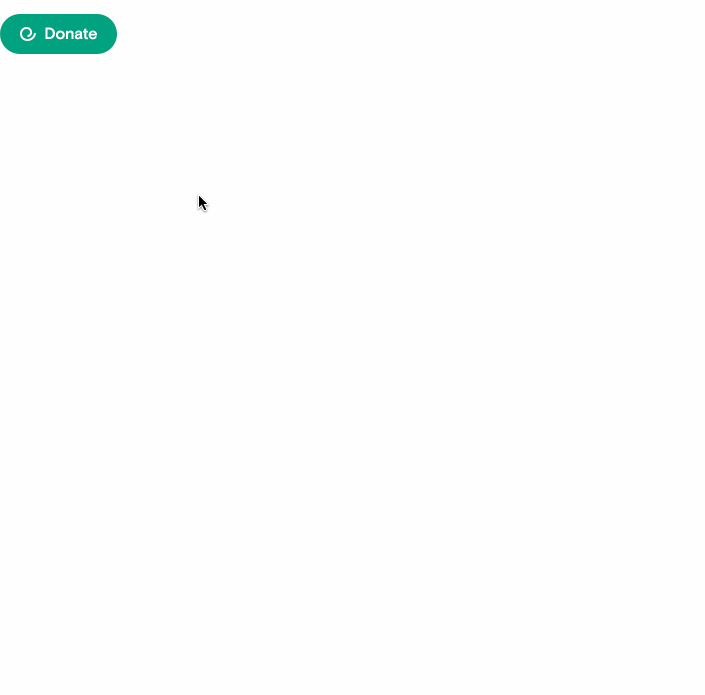

# Donate Button

The open-source [Every.org](http://every.org) Donate button provides a beautiful
donation experience so that you can accept donations for your nonprofit on your
website immediately, just by copying in a code snippet into your webpage.

[Click here to see a demo](https://embeds.every.org/0.4) showing what it looks
like.

## Usage

For the latest documentation on how to use the `donate-button`,
[click here to view the `README` on the Donate Button codebase](https://github.com/everydotorg/donate-button#everyorg-donate-button).

For specific examples for how to embed on your platform, see the following
documents:

- [Squarespace](https://github.com/everydotorg/donate-button/wiki/Deploy-to-Squarespace)
- [Weebly](https://github.com/everydotorg/donate-button/wiki/Deploy-to-Weebly)
- [Wix](https://github.com/everydotorg/donate-button/wiki/Deploy-to-Wix)
- [Wordpress](https://github.com/everydotorg/donate-button/wiki/Deploy-to-Wordpress)
