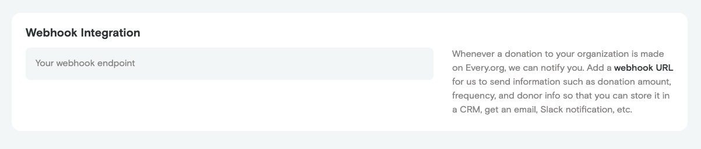

import RequestFormat from "./_nonprofit-request-format.mdx";

# Nonprofit Donation Webhook

:::tip Learn more

Don't know what a webhook is? Learn more from this
[What are webhooks?](https://zapier.com/blog/what-are-webhooks/) blog post.

:::

**The nonprofit donation [webhook](https://www.getvero.com/resources/webhooks)
allows a nonprofit to be notified every time a donation is made.**

We will make a POST request to the specified webhook with information about the
donation every time a donation is completed\*. One common use case for setting
such a webhook is to create a custom integration between Every.org and a donor
CRM.

## Setting up your webhook

You can set your webhook URL by editing your organization's settings at
`every.org/<organization-slug>/admin/settings` under `Advanced settings`.

## Data format

<RequestFormat />

If you have any questions about the usage of this webhook, please contact
[team@every.org](mailto:team@every.org).
